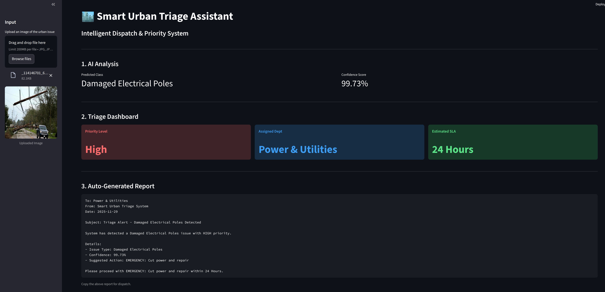

# CV-SUTA: A Computer Vision-powered Smart Urban Triage Assistant based on ResNet18

This project implements a deep learning model to classify images of urban issues (e.g., potholes, trash, graffiti). It uses a ResNet18 architecture and is built with PyTorch and Hydra.

## Project Structure

```
urban_issues/
├── config/             # Configuration files (Hydra)
│   └── train.yaml      # Training configuration
├── data/               # Dataset directory (ignored by git)
├── notebooks/          # Jupyter notebooks for analysis
│   ├── results_analysis.ipynb  # Learning curves and confusion matrix
│   └── error_analysis.ipynb    # Visualization of model errors
├── src/                # Source code
│   ├── data/
│   │   └── dataset.py  # Custom Dataset class
│   └── train.py        # Training script
├── environment.yml     # Conda environment specification
├── pyproject.toml      # Project metadata and dependencies
└── README.md           # This file
```

## Installation

1.  **Clone the repository:**
    ```bash
    git clone <repository_url>
    cd urban_issues
    ```

2.  **Set up the environment:**
    Ensure you have [Conda](https://docs.conda.io/en/latest/) installed.
    ```bash
    conda env create -f environment.yml
    conda activate urban_issues_env
    ```

## Usage

### CV-SUTA Assistant Interface



In order to launch the CV-SUTA assistant interface, run

```bash
streamlit run app.py
```

Keep in mind that in order to get the reports, you are expected to have already trained a model, storing its weights under best_model.pth
### Training

To train the model, run the `train.py` script. You can modify parameters in `config/train.yaml` or override them on the command line.

```bash
python src/train.py
```

**Override examples:**
```bash
python src/train.py epochs=20 batch_size=64
```

### Analysis

There are two notebooks provided for analyzing the results:

*   **`notebooks/results_analysis.ipynb`**: Visualizes learning curves (loss/accuracy) and the confusion matrix.
*   **`notebooks/error_analysis.ipynb`**: examines specific misclassified examples to understand model weaknesses.

## Data

The dataset used is [Kaggle Urban Issues by Himan, A.](https://www.kaggle.com/datasets/akinduhiman/urban-issues-dataset), which is expected to be found in the `data/` directory. It should be organized by dataset name, split (`train`, `valid`, `test`) and then by object.

```
data/
├── class_a/
│   ├── train/
│   │   ├── images/ ... the jpg files go here
│   │   ├── labels/ ... dataset contains .txt files (left unused)
│   ├── test/
│   │   ├── images/
│   │   ├── labels/
│   ├── validation/
│   │   ├── images/
│   │   ├── labels/
└── class_b/
    ├── ...
```

## Model

The model is a **ResNet18** pretrained on ImageNet. The final fully connected layer is replaced to match the number of classes in the Urban Issues dataset.

## License

Apache-2.0
